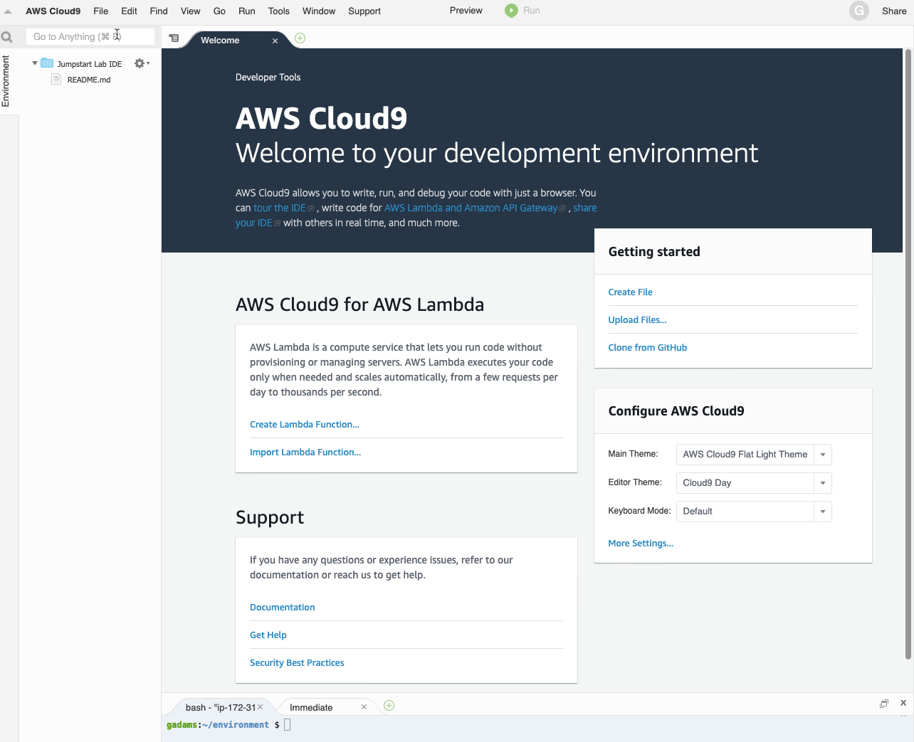

# Copyright Amazon.com, Inc. or its affiliates. All Rights Reserved. 
## SPDX-License-Identifier: CC-BY-SA-4.0

# Amazon Sidewalk

Amazon Sidewalk is a service where Amazon provides the Gateway and the customer brings the device. Amazon Sidewalk currently supports FSK, BLE and LoRa for device to Gateway communication. Amazon Echo's and Ring camera's serve as Gateways when Sidewalk is enabled on these Gateways. Amazon Sidewalk is designed with [Security First](https://m.media-amazon.com/images/G/01/sidewalk/final_privacy_security_whitepaper.pdf) to ensure privacy of customer data. The devices connect to Amazon Gateways to send data to your AWS Account. 

This code is an accelerator to setup the Sidewalk quickly in your Amazon Developer and AWS account.

## Simulator

The [simulator](simulator) is a quick start to undertsand the AWS IoT data flow from a simulated Sidewalk Device. The README in that directory dives into the detail of what the simulator does and how to install it.

## Hardware

Amazon Sidewalk will have SDK for many different hardware. For each hardware, we will have the directions for easy setup here. We have started with [Nordic Hardware Development Kit](hardware/NordicKit)

We will update this as we release new hardware kits.

## Common Prerequisites 

* AWS Cloud
  * Ensure you have an AWS user account with permissions to manage `iot`, `iotwireless`, `iotanalytics`, `lambda`, `cloudwatch`, and other services during the deployment of the CloudFormation stack.
  * Create an S3 bucket *in the same region where CloudFormation resources will be created* to hold the packaged files. Please see [this link](https://docs.aws.amazon.com/AWSCloudFormation/latest/UserGuide/using-cfn-cli-package.html) for more details.
* Local Environment 
  * Ensure a recent version of the AWS CLI is installed and a user profile with permissions mentioned above is available for use.

## Cloud9

If you don't have a local environment, you can create a linux machine using Cloud9. 

### Create a New Cloud9 IDE Instance

From the AWS Console, navigate to *Cloud9*, select the region you will be running the simulator in, then create a new environment with the following environment settings:

a. From your web browser login into the AWS Console and navigate to *Services->Cloud9*.

b. From the Cloud9 page, click on *Create environment*.

c. Fill out the name and optionally the description, then click *Next step*:

d. Under *Environment settings* select the following:


e. For the *Network settings*, ensure you select a VPC and subnet that is publicly accessible to the Internet. If unsure, select the default VPC and one of the subnets.

f. Then click *Next step* at the bottom (not shown in image above).

g. Review the settings then click *Create environment*. This will change to the IDE window, and after a couple minutes the IDE will appear similar to this:



h. Since the CLoud9 IDE tag replaces the AWS Console, click on *AWS Cloud9* and select *Go To Your Dashboard*, which will open a new browser window or tab with the Cloud9 console loaded. You can then use that tab to navigate between other AWS services.


### Setup Cloud9 Tabs and Folders

With Cloud9 open:

The username shown at the command prompt will reflect your AWS Console user account, and will be different that the example shown below.

a. Close the *Welcome Tab* and open a *New Terminal*.


b. From the Settings drop-down, deselect *Show Environment Root*, and select *Show Home in Favorites* so that the folder list and selections look like this:


c. With the tabs and folder settings changes, from the new terminal pane issue the command `cd` to change to the home directory and issue the command `pwd` to verify you are in `/home/ec2-user`.


### Verify Internet Connectivity and Obtain Public IP Address

a. Test Internet connectivity by pinging a known IP address on the Internet.

    **Command Input: (enter CTRL+C to break out of the ping command)**
    ```console
    ping 8.8.8.8
    ```

    **Command Output:**

    ```console
    PING 8.8.8.8 (8.8.8.8) 56(84) bytes of data.
    64 bytes from 8.8.8.8: icmp_seq=1 ttl=42 time=9.12 ms
    64 bytes from 8.8.8.8: icmp_seq=2 ttl=42 time=9.15 ms
    64 bytes from 8.8.8.8: icmp_seq=3 ttl=42 time=9.17 ms
    ^C
    --- 8.8.8.8 ping statistics ---
    3 packets transmitted, 3 received, 0% packet loss, time 2002ms
    rtt min/avg/max/mdev = 9.123/9.150/9.176/0.112 ms
    ```