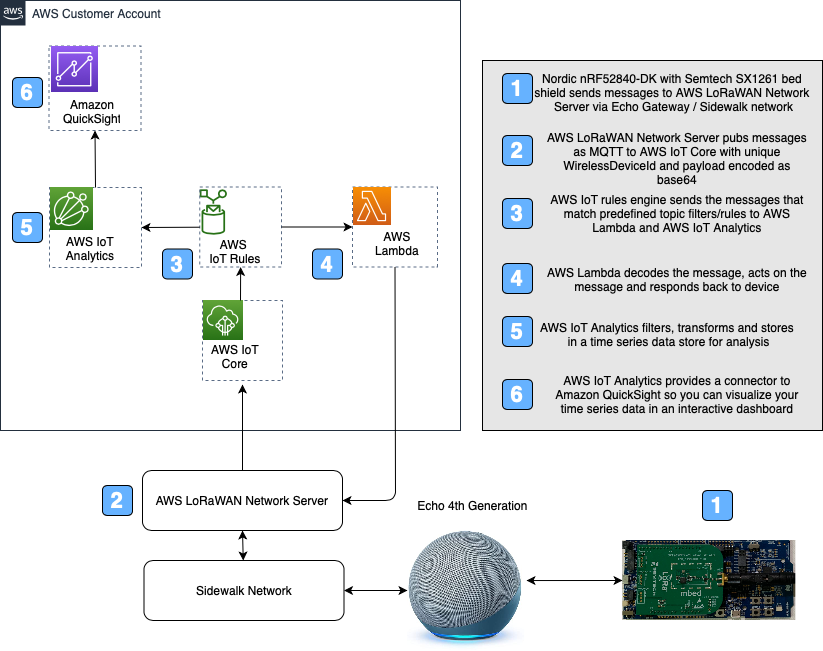

# Copyright Amazon.com, Inc. or its affiliates. All Rights Reserved. 
## SPDX-License-Identifier: CC-BY-SA-4.0

# Sidewalk Hardware

The sidewalk hardware details setting up a device with your AWS enviroment. The artifacts here will help you setup a flow detailed here:



The Nordic board outlined above will send a incrementing counter. This message can be seen in AWS IoT Core in the following format:

```console
{
  "MessageId": "String"         # EventId 
  "WirelessDeviceId": "String"  # DeviceId
  "PayloadData": "String"       # Message Payload encoded in base64 
  "WirelessMetaData":
    {
      "Seq": "Integer"          # Sequence number
    }
}
```

The Cloud formation script will setup the components in your AWS account to take the message and route it to AWS Lambda. The Lambda function will decode the payload, add a 10 to the payload and send it back to the Wireless device with the format:

```console
{
  "MessageId": "string"         # This will be used as eventId
  "WirelessDeviceId": "string"  # DeviceId
  "PayloadData": "string"      
  "WirelessMetaData":
  {
    "Sidewalk":
    { 
      "Seq": "Integer"          # Sequence number
    }
  }
}
```

The cloud formation script will also send the messages to AWS IoT Analytics which will call a Lambda function to decode the payload and store the data in a time series data store which can be analyzed by Amazon QuickSight.

## Setup

The setup consists of two parts:

1. AWS Cloud 
2. Hardware using your Amazon account which is the target system.

## AWS Cloud Deployment

The files required for AWS Cloud are this directory:

### Folder Structure

```text
NordicKit/
├── README.md                           <-- This file!
├── sidewalk_nordic-INPUT.cfn.yaml   <-- CloudFormation template
├── lambda_functions
├── docs
```

### Verify Prerequisites

No additional prerequisites than those specified in the root folder.


### The steps mentioned below can be run on Cloud9 or your local machine.

### Launch the CloudFormation Stack

Prior to launching the simulator, a CloudFormation package needs to be created, and then the CloudFormation stack launched from the Template. Follow the steps below to create the package via the command line, and then launch the stack via the CLI or AWS Console.

The CloudFormation template does most of the heavy lifting. Prior to running, each *input* template needs to be processed to an *output* template that is actually used. The package process uploads the Lambda functions to the S3 bucket and creates the output template with unique references to the uploaded assets. 

To create or overwrite the templates, perform the following steps from a command line or terminal session:

1. Clone the repository `amazon-sidewalk` and change to `hardware/NordicKit`, where this README.md file is located.

2. Create the CloudFormation output file using the AWS CLI.  Using the commands below, you can either preset the \$AWS_PROFILE, \$REGION, and \$S3_BUCKET variables, or reference those directly via the `aws cloudformation package` command. The result of that command will be an *OUTPUT* CloudFormation template file, along with the packaged Lambda functions being copied to the S3 bucket. The `AWS_PROFILE` contains the credentials, account details, and optionally region to create the CloudFormation stack.

If you are using Cloud9, AWS_PROFILE can be set to default.

Complete list of commands to create the CloudFormation template file, upload assets, and create a stack (note the changes for the `--parameter-overrides` section).
   
```text
export AWS_PROFILE=your-profile-here
export REGION=us-east-1
export S3_BUCKET=your_s3_bucket_here # In same region as the CloudFormation stack 
                                                
# Clean up any previously created files
rm *-OUTPUT.yaml
aws cloudformation package --template-file sidewalk_nordic-INPUT.cfn.yaml --output-template-file sidewalk_nordic-OUTPUT.yaml --s3-bucket $S3_BUCKET --profile $AWS_PROFILE --region $REGION
     
# If using the AWS Console, upload the sidewalk_simulator-OUTPUT.yaml and 
# continue with the parameters.
# Below are the steps to deploy via the command line.
     
# To deploy back-end stack from CLI 
# (change --stack-name and --parameter-overrides to expected values)
aws cloudformation deploy \
    --region $REGION \
    --stack-name sidewalk_nordic \
    --template sidewalk_nordic-OUTPUT.yaml \
    --capabilities CAPABILITY_NAMED_IAM
   
# Output of stack deploy command:
Waiting for changeset to be created..
Waiting for stack create/update to complete
Successfully created/updated stack - sidewalk_nordic
```

At this point, all Cloud resources have been created.


### Hardware device

Your [Amazon Sidewalk developer console](https://developer.amazon.com/acs-devices/console/sidewalk/products) walks you through setting up the hardware. [Sidewalk Documentation under Learn](https://developer.amazon.com/acs-devices/console/sidewalk/help/documentation) has a [Quick Start Guide](https://developer.amazon.com/acs-devices/console/sidewalk/docs/group__quickstart__guide.html) which has the details to setup the Nordic Hardware Development kit and Designing the Product. As part of [Designing Your Product](https://developer.amazon.com/acs-devices/console/sidewalk/docs/group__qsg__step2.html) you will install a software package on the [Nordic Board](https://www.nordicsemi.com/Software-and-tools/Development-Kits/nRF52840-DK) that will send incrementing counters on button pushes to Sidewalk network.   

All the work that is detailed in [Step 3: Configure your Cloud](https://developer.amazon.com/acs-devices/console/sidewalk/docs/group__qsg__step3.html) has been completed by the AWS Cloud Side Deployment we did earlier. You need to do is in steps 3.2 and 3.4, where you need to choose 'SidewalkNordic' as the desitnation.

The AWS Cloud Side Deployment we did earlier setup the Lambda function and republish logic. Again in [Step 7: Test with Sidewalk](https://developer.amazon.com/acs-devices/console/sidewalk/docs/group__qsg__step7.html) you can look for CloudWatch Logs for the SidewalkNordicProcessFunction and MQTT client subscribed to wildcard (#) topic.

## Verification

1. To verify data coming into AWS IoT, you can navigate to the IoT Core console and click on "Test" on the left panel. Select # and Subscribe to topic for wild card subscription.
2. You can also look at sidewalkhardwaredataset for data being stored in IoT Analytics.

### Visualizing the Data

The data can be visualized by using Quicksight easily. Open the QuickSight dashboard in the same region we have run the cloud formation. 

2. Click on Manage data
3. Click on New data set
3. Pick AWS IoT Analytics
4. Pick sidewalksimulatordataset
5. Click Create data source
6. Click Visualize

## License Summary

This project is made available under the CC-BY-SA-4.0 license. See the LICENSE file.