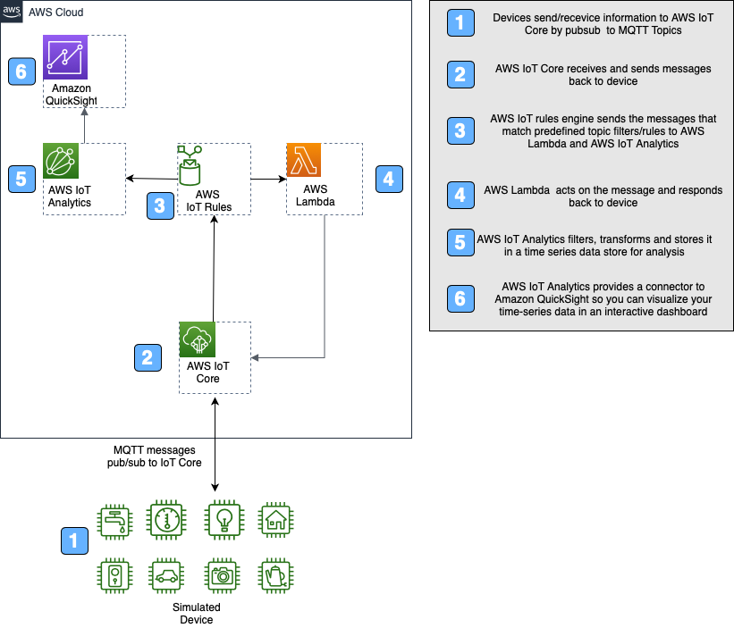
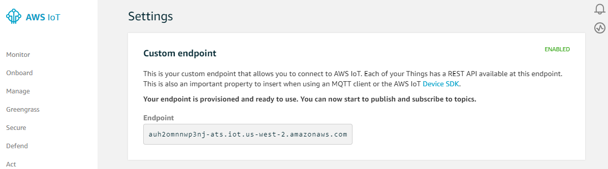

# Copyright Amazon.com, Inc. or its affiliates. All Rights Reserved. 
## SPDX-License-Identifier: CC-BY-SA-4.0

# Sidewalk Simulator

The sidewalk device simulator is used to simulate a sidewalk device sending commands to AWS IoT Core. 

### The design is composed of two main parts:

* The source - The source is a python script that generates data in the format that will land in AWS IoT Core. The data format is:

```console
{
  "MessageId": "String"         # In case of sidewalk, eventId is passed
  "WirelessDeviceId": "String"  # Sailboat DeviceId
  "PayloadData": "String"       # Message Payload encoded in base64 
  "WirelessMetaData":
    {
      "Seq": "Integer"          # Sidewalk specific 
    }
}
```

The python script can be modified to change the data.
The python script subscribes to messages from AWS IoT Core and prints the messages that it receives.

* Destination (AWS Cloud) - The destination for the data and response for data. The cloud receives the data and uses the Rules Engine created with 2 actions:
- send data to AWS IoT Anaytics. This data is stored in the Service Managed S3 and can be analyzed using QuickSight.
- send data to AWS Lambda. The Lambda function will decode the payload, add a 10 to the payload and send it back to the Wireless device with the format:

```console
{
  "MessageId": "string"         # This will be used as eventId
  "WirelessDeviceId": "string"  # Sailboat deviceId
  "PayloadData": "string"      
  "WirelessMetaData":
  {
    "Sidewalk":
    { 
      "Seq": "Integer"          # Sidewalk specific 
    }
  }
}
```



## Setup

There are two main components to use the simulator. The CloudFormation assets to create the cloud side and a simulator running on your local machine or Cloud9. 

### Folder Structure

```text
simulator/
├── README.md                           <-- This file!
├── sidewalk_device.py                  <-- Python device simulator
├── sidewalk_simulator-INPUT.cfn.yaml   <-- CloudFormation template
├── lambda_functions
├── docs
```

## How to Deploy the Simulator

To launch this simulator, there are a few prerequisites and steps to complete. It is assumed you have basic experience with AWS IoT via the console and CLI.

The main steps for deployment are:

1. *Complete prerequisites*. Ensure there is an AWS IoT certificate and private key created and accessible locally for use.
2. *Generate and launch the CloudFormation stack*. This will create the AWS IoT thing, AWS Lambda functions and AWS IoT Analytics to analyze data.
3. *Run the python script*.

When finished, stop the python script (`CTRL-C` ).

### Verify Prerequisites

The following is a list of additional prerequisites to deploy the simulator:

* AWS Cloud
  * Create an AWS IoT Certificate and ensure it is activated and the certificate and private key files are saved locally. This certificate will be associated with an AWS IoT *thing* created by the CloudFormation stack. Copy the certificates *Certificate ARN*, which will be used as a parameter for the CloudFormation stack. The *Certificate ARN* will look similar to this: `arn:aws:iot:REGION:ACCOUNTNAME:cert/27b42xxxxxxx120017a`.
* Local Environment (Or Cloud9)
  * Install python 3.5+ on your local machine.
  * Install AWS IoT Python SDK on your local machine. (https://github.com/aws/aws-iot-device-sdk-python-v2)

### The steps mentioned below can be run on Cloud9 or your local machine.

### Launch the CloudFormation Stack

Prior to launching the simulator, a CloudFormation package needs to be created, and then the CloudFormation stack launched from the Template. Follow the steps below to create the package via the command line, and then launch the stack via the CLI or AWS Console.

The CloudFormation template does most of the heavy lifting. Prior to running, each *input* template needs to be processed to an *output* template that is actually used. The package process uploads the Lambda functions to the S3 bucket and creates the output template with unique references to the uploaded assets. 

To create or overwrite the templates, perform the following steps from a command line or terminal session:

1. Clone the repository `amazon-sidewalk` and change to `simulator`, where this README.md file is located.

2. Create the CloudFormation output file using the AWS CLI.  Using the commands below, you can either preset the \$AWS_PROFILE, \$REGION, and \$S3_BUCKET variables, or reference those directly via the `aws cloudformation package` command. The result of that command will be an *OUTPUT* CloudFormation template file, along with the packaged Lambda functions being copied to the S3 bucket. The `AWS_PROFILE` contains the credentials, account details, and optionally region to create the CloudFormation stack.

If you are using Cloud9, AWS_PROFILE can be set to default.

Complete list of commands to create the CloudFormation template file, upload assets, and create a stack (note the changes for the `--parameter-overrides` section).

   
```bash
# BASH commands (replace exports with your AWSCLI profile, region, and S3 bucket settings)
# AWS_PROFILE contains permissions to fully create and launch the CloudFormation package and template
export AWS_PROFILE=your-profile-here
export REGION=us-east-1
export S3_BUCKET=your_s3_bucket_here  # In same region as the CloudFormation stack 
                                               
#Setup the region is aws configure to be the same as the one set above. This can be done by typing: 
aws configure 
and selecting the region
   
# Create keys and certificate and save the keys and certificate arn. The certificate arn is the first output
aws iot create-keys-and-certificate \
    --set-as-active \
    --certificate-pem-outfile "certificate.pem" \
    --public-key-outfile "publicKey.pem" \
    --private-key-outfile "privateKey.pem"
   
# Clean up any previously created files
rm *-OUTPUT.yaml
aws cloudformation package --template-file sidewalk_simulator-INPUT.cfn.yaml --output-template-file sidewalk_simulator-OUTPUT.yaml --s3-bucket $S3_BUCKET --profile $AWS_PROFILE --region $REGION
     
# If using the AWS Console, upload the sidewalk_simulator-OUTPUT.yaml and continue with the parameters.
# Below are the steps to deploy via the command line.
     
# To deploy back-end stack from CLI (change --stack-name and --parameter-overrides to expected values)
aws cloudformation deploy \
    --region $REGION \
    --stack-name sidewalk_simulator \
    --template sidewalk_simulator-OUTPUT.yaml \
    --capabilities CAPABILITY_NAMED_IAM\
    --parameter-overrides \
    CertificateArn="certificate ARN from prerequisites"  \
    ThingName="SidewalkSimulatorThing"
   
# Output of stack deploy command:
Waiting for changeset to be created..
Waiting for stack create/update to complete
Successfully created/updated stack - sidewalk_simulator
```

At this point, all resources have been created in the cloud have been created.


### Launch the device simulator

To launch the simulator:

1. Navigate to the IoT Core console and click on "Settings" on the bottom left panel. You'll need your specified endpoint to connect from the device in Step 4.

2. Install AWS IoT SDK by typing ```sudo pip install awsiotsdk ```
3. For linux, get the Amazon RootCA in the same directory by typing ```wget https://www.amazontrust.com/repository/AmazonRootCA1.pem ```
4. Start the simulator by typing using the endpoint from Step 1 ```python sidewalk_device.py --endpoint xxxxxxxxxxx-ats.iot.us-east-1.amazonaws.com --root-ca AmazonRootCA1.pem --cert certificate.pem --key privateKey.pem --count 0 ```

## Verification

1. To verify data coming into AWS IoT, you can navigate to the IoT Core console and click on "Test" on the left panel. Select # and Subscribe to topic for wild card subscription.
2. The sidewalk_simulator will see data comimg from the Cloud and and you will see the prints on the python program.
3. You can also look at sidewalksimulatordataset for data being stored in IoT Analytics.

### Visualizing the Data

The data can be visualized by using Quicksight easily. Open the QuickSight dashboard in the same region we have run the cloud formation. 

2. Click on Manage data
3. Click on New data set
3. Pick AWS IoT Analytics
4. Pick sidewalksimulatordataset
5. Click Create data source
6. Click Visualize
